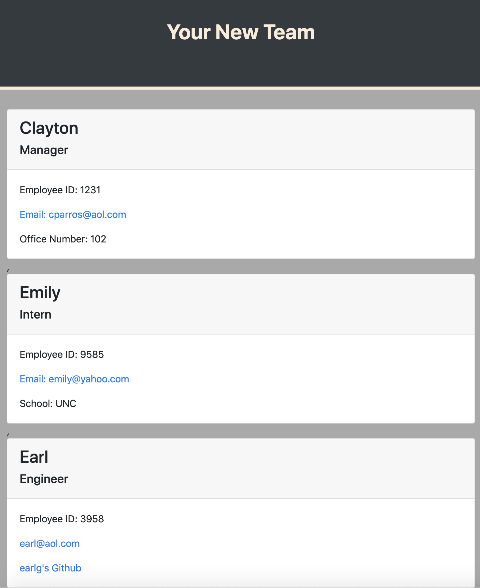

# team-generator

This application is designed to dynamically render an html page that shows a working team of Managers, Interns, and engineers in response to a user's input.

## Installation

Use: npm i inquirer 
Use: npm i jest

##
Testing use: npm run test

## Questions
Celparros@gmail.com
